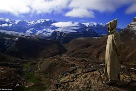

# 🎯 Tour Page Assignments - Final Implementation Guide

**Date:** October 20, 2025  
**Status:** ✅ Ready for Implementation  
**Based on:** TOUR_CATEGORIZATION.md

---

## 📋 Quick Reference

| Page | Tours Assigned | File Name |
|------|---------------|-----------|
| **Agadir Tours** | 1 tour | `agadir-tours.html` |
| **Day Trips** | 1 tour | `day-trips-from-agadir.html` |
| **Things to Do** | 3 tours | `things-to-do-in-agadir.html` |

---

## 🏛️ PAGE 1: AGADIR TOURS

**File:** `/Users/macbookair/Desktop/local guide/agadir-tours.html`

**Page Purpose:** City-focused sightseeing and cultural experiences within Agadir

**Target Keywords:** 
- "Agadir tours"
- "guided tours in Agadir"
- "Agadir sightseeing"
- "best tours in Agadir"

### ✅ Tours to Display on This Page:

#### 1. Agadir City Tour
- **File:** `tour-agadir-city-tour.html`
- **Price:** €30 per person
- **Duration:** 4 hours (half day)
- **Rating:** 4.8/5 stars (312 reviews)
- **Link Text:** "Agadir City Tour & Kasbah"
- **Description:** Discover Agadir's highlights including the historic Kasbah, Souk El Had market, and panoramic views of the city and coastline.
- **Category Badge:** "CULTURAL" or "CITY TOUR"
- **Features:** 🚗 Hotel Pickup | 👨‍🏫 Local Guide | 🏛️ Kasbah Entry

**⚠️ Note:** Currently this page shows many tours from other categories. It should ONLY show the Agadir City Tour.

---

## 🚌 PAGE 2: DAY TRIPS FROM AGADIR

**File:** `/Users/macbookair/Desktop/local guide/day-trips-from-agadir.html`

**Page Purpose:** Full or half-day excursions outside of Agadir to nearby attractions

**Target Keywords:**
- "day trips from Agadir"
- "excursions from Agadir"
- "Agadir day tour"
- "where to go from Agadir"

### ✅ Tours to Display on This Page:

#### 1. Paradise Valley Agadir
- **File:** `tour-paradise-valley-agadir.html`
- **Price:** €35 per person
- **Duration:** 4-5 hours
- **Rating:** High ratings (estimated 4.8+/5)
- **Link Text:** "Paradise Valley with Lunch"
- **Description:** Discover natural pools and stunning waterfalls nestled in the Atlas Mountains. Includes traditional Moroccan lunch and swimming opportunities.
- **Category Badge:** "NATURE" or "DAY TRIP"
- **Features:** 🚗 Hotel Pickup | 🍽️ Lunch Included | 🏊 Swimming

**Additional Tours on This Page (Already Listed):**
- ✅ Marrakech Day Trip (€55)
- ✅ Essaouira Day Trip
- ✅ Taroudant Day Trip
- ✅ Souss-Massa National Park (€45)
- ✅ Berber Village Tour (€42)

**⚠️ Note:** This page is correctly set up as a "Day Trips" page. Paradise Valley belongs here.

---

## 🎯 PAGE 3: THINGS TO DO IN AGADIR

**File:** `/Users/macbookair/Desktop/local guide/things-to-do-in-agadir.html`

**Page Purpose:** Activities and experiences within or near Agadir that visitors can enjoy

**Target Keywords:**
- "things to do in Agadir"
- "Agadir activities"
- "what to do in Agadir"
- "Agadir experiences"

### ✅ Tours to Display on This Page:

#### 1. Camel Ride in Agadir
- **File:** `tour-camel-ride-agadir.html`
- **Price:** €40 per person
- **Duration:** 4-5 hours (1hr ride + 2hrs dinner/entertainment)
- **Rating:** 4.8/5 stars (289 reviews)
- **Link Text:** "Sunset Camel Ride on Beach"
- **Description:** Romantic camel ride along Agadir's beautiful coastline at sunset. Experience traditional Moroccan transportation with breathtaking views.
- **Category Badge:** "ROMANTIC" or "ACTIVITY"
- **Features:** 🚗 Hotel Pickup | 🌅 Sunset Views | 📸 Photo Ops

#### 2. Horse Riding Agadir
- **File:** `tour-horse-riding-agadir.html`
- **Price:** €45 per person
- **Duration:** 2-2.5 hours (1.5hrs riding)
- **Rating:** 4.9/5 stars (256 reviews)
- **Link Text:** "Horseback Ride on the Beach"
- **Description:** Gallop along the stunning Agadir coastline on well-trained horses. Perfect for beginners and experienced riders with beautiful ocean views.
- **Category Badge:** "BEACH ACTIVITY" or "ADVENTURE"
- **Features:** 🐴 All Levels | 👨‍🏫 Guide Included | 📸 Beach Photos

#### 3. Sandboarding in Agadir
- **File:** `tour-sandboarding-agadir.html`
- **Price:** €50 per person
- **Duration:** 3-4 hours (2hrs boarding + 1hr BBQ)
- **Rating:** 4.7/5 stars (198 reviews)
- **Link Text:** "Sandboarding & Canyon Visit"
- **Description:** Surf the golden sand dunes and explore dramatic canyons. All equipment provided with professional instruction for beginners and experts.
- **Category Badge:** "ADVENTURE" or "DESERT ACTIVITY"
- **Features:** 🚗 Hotel Pickup | 🏄 Equipment Included | 👨‍🏫 Instructor

**Additional Activities on This Page (Already Listed):**
- ✅ Quad Biking (€45)
- ✅ Surf Lessons
- ✅ Jet Skiing
- ✅ Buggy Adventure (€65)
- ✅ Moroccan Hammam & Spa (€40)
- ✅ Cooking Class
- ✅ Boat Trip & Fishing (€48)

**⚠️ Note:** This page is correctly set up. Our 3 tours fit perfectly here.

---

## 🔧 Implementation Checklist

### For `agadir-tours.html`:
- [ ] **Remove all non-city tours** (currently shows 12 tours, should show 1)
- [ ] **Keep only:** Agadir City Tour
- [ ] **Update hero text** to focus on "City Sightseeing"
- [ ] **Update meta description** to emphasize city tours
- [ ] **Update category filters** if they exist
- [ ] **Add expansion section** suggesting future city tours (Food Tour, Night Tour, etc.)

### For `day-trips-from-agadir.html`:
- [x] **Paradise Valley is already listed** ✅
- [ ] **Verify it links to:** `tour-paradise-valley-agadir.html`
- [ ] **Ensure proper pricing:** €35 per person
- [ ] **Verify description** matches categorization
- [ ] **Keep existing day trips** (Marrakech, Essaouira, Taroudant, etc.)

### For `things-to-do-in-agadir.html`:
- [x] **Camel Ride is already listed** ✅
- [x] **Horse Riding is already listed** ✅
- [x] **Sandboarding is already listed** ✅
- [ ] **Verify links:**
  - Camel → `tour-camel-ride-agadir.html`
  - Horse → `tour-horse-riding-agadir.html`
  - Sandboarding → `tour-sandboarding-agadir.html`
- [ ] **Verify pricing matches:**
  - Camel: €40
  - Horse: €45
  - Sandboarding: €50
- [ ] **Keep other activities** (Quad, Surfing, Jet Ski, Hammam, etc.)

---

## 📊 Current Status vs. Desired Status

### AGADIR TOURS Page:

**Current Status:**
- ❌ Shows 12 tours including adventures, day trips, wellness
- ❌ Mixed categories (adventure, cultural, day-trips, water, wellness)
- ❌ Not focused on city tours

**Desired Status:**
- ✅ Shows ONLY 1 tour: Agadir City Tour
- ✅ Focused on city sightseeing and cultural experiences in Agadir
- ✅ Clear messaging about exploring the city itself

---

### DAY TRIPS Page:

**Current Status:**
- ✅ Already properly categorized
- ✅ Shows Paradise Valley and other day trips
- ✅ Correct focus on excursions outside Agadir

**Desired Status:**
- ✅ No changes needed (already correct!)
- ✅ Paradise Valley is properly listed

---

### THINGS TO DO Page:

**Current Status:**
- ✅ Already properly categorized
- ✅ Shows Camel, Horse, Sandboarding + other activities
- ✅ Correct focus on activities and experiences

**Desired Status:**
- ✅ No changes needed (already correct!)
- ✅ All 3 tours are properly listed

---

## 🎨 Visual Assignment Summary

```
📁 WEBSITE STRUCTURE

├── 🏛️ AGADIR TOURS (agadir-tours.html)
│   └── 1. Agadir City Tour (€30)
│
├── 🚌 DAY TRIPS (day-trips-from-agadir.html)
│   ├── 1. Paradise Valley (€35) ✅
│   ├── 2. Marrakech Day Trip (€55) ✅
│   ├── 3. Essaouira Day Trip ✅
│   ├── 4. Taroudant Day Trip ✅
│   ├── 5. Souss-Massa Park (€45) ✅
│   └── 6. Berber Villages (€42) ✅
│
└── 🎯 THINGS TO DO (things-to-do-in-agadir.html)
    ├── 1. Camel Ride (€40) ✅
    ├── 2. Horse Riding (€45) ✅
    ├── 3. Sandboarding (€50) ✅
    ├── 4. Quad Biking (€45) ✅
    ├── 5. Buggy Adventure (€65) ✅
    ├── 6. Hammam & Spa (€40) ✅
    ├── 7. Surf Lessons ✅
    ├── 8. Jet Skiing ✅
    ├── 9. Cooking Class ✅
    └── 10. Boat Trip (€48) ✅
```

---

## 🔗 Tour File Mapping

| Tour Name | HTML File | Category Page | Status |
|-----------|-----------|---------------|--------|
| Agadir City Tour | `tour-agadir-city-tour.html` | `agadir-tours.html` | ⏳ Needs assignment |
| Paradise Valley | `tour-paradise-valley-agadir.html` | `day-trips-from-agadir.html` | ✅ Already assigned |
| Camel Ride | `tour-camel-ride-agadir.html` | `things-to-do-in-agadir.html` | ✅ Already assigned |
| Horse Riding | `tour-horse-riding-agadir.html` | `things-to-do-in-agadir.html` | ✅ Already assigned |
| Sandboarding | `tour-sandboarding-agadir.html` | `things-to-do-in-agadir.html` | ✅ Already assigned |

---

## 📝 HTML Code Snippets for Each Tour

### For Agadir City Tour (agadir-tours.html):

```html
<!-- Tour Card: Agadir City Tour -->
<div class="tour-card" data-category="cultural">
    <div class="tour-image-wrapper" style="position: relative;">
        
        <div class="tour-duration" style="position: absolute; bottom: 15px; left: 15px; background: rgba(255,255,255,0.95); padding: 5px 12px; border-radius: 15px; font-size: 13px; font-weight: 600;">4 Hours</div>
    </div>
    <div class="tour-content" style="padding: 25px; background: white; border-radius: 0 0 10px 10px; box-shadow: 0 4px 20px rgba(0,0,0,0.1);">
        <div style="display: flex; align-items: center; gap: 8px; margin-bottom: 12px;">
            <div style="color: #f39c12; font-size: 14px;">★★★★★</div>
            <span style="font-weight: 600; color: #333; font-size: 14px;">4.8 (312 reviews)</span>
        </div>
        <h3 style="font-size: 1.4rem; font-weight: 700; color: #1F2937; margin-bottom: 12px;">Agadir City Tour & Kasbah</h3>
        <p style="color: #6B7280; line-height: 1.6; margin-bottom: 15px; font-size: 15px;">Discover Agadir's highlights including the historic Kasbah, Souk El Had market, and panoramic views of the city and coastline.</p>
        <div style="display: flex; gap: 15px; margin-bottom: 15px; font-size: 13px; color: #6B7280;">
            <span>🚗 Hotel Pickup</span>
            <span>👨‍🏫 Local Guide</span>
            <span>🏛️ Kasbah Entry</span>
        </div>
        <div style="display: flex; justify-content: space-between; align-items: center; padding-top: 15px; border-top: 1px solid #eee;">
            <div>
                <span style="font-size: 1.5rem; font-weight: 700; color: #1F2937;">€30</span>
                <span style="font-size: 14px; color: #999;"> / person</span>
            </div>
            <a href="tour-agadir-city-tour.html" style="background: #cdff03; color: #000000; padding: 12px 24px; border-radius: 6px; font-weight: 700; font-size: 14px; text-decoration: none; transition: all 0.3s;">View Tour</a>
        </div>
    </div>
</div>
```

---

## 🎯 Main Action Required

### PRIMARY TASK: Clean up `agadir-tours.html`

**Current:** Shows 12 mixed tours  
**Needed:** Show ONLY 1 tour (Agadir City Tour)

**Tours to REMOVE from agadir-tours.html:**
1. ❌ ATV Quad Bike Safari (→ move to Things to Do)
2. ❌ Paradise Valley (→ already in Day Trips) ✅
3. ❌ Camel Ride (→ already in Things to Do) ✅
4. ❌ Sandboarding (→ already in Things to Do) ✅
5. ❌ Marrakech Day Trip (→ already in Day Trips) ✅
6. ❌ Berber Village Tour (→ already in Day Trips) ✅
7. ❌ Horseback Riding (→ already in Things to Do) ✅
8. ❌ Hammam & Spa (→ already in Things to Do) ✅
9. ❌ Boat Cruise (→ already in Things to Do) ✅
10. ❌ Buggy Safari (→ already in Things to Do) ✅
11. ❌ Souss-Massa Park (→ already in Day Trips) ✅

**Tours to KEEP in agadir-tours.html:**
1. ✅ Agadir City Tour

---

## ✅ Summary

### Tours Properly Categorized:

✅ **Agadir City Tour** → Agadir Tours page (city sightseeing)  
✅ **Paradise Valley** → Day Trips page (excursion outside Agadir)  
✅ **Camel Ride** → Things to Do page (activity/experience)  
✅ **Horse Riding** → Things to Do page (beach activity)  
✅ **Sandboarding** → Things to Do page (desert adventure)

### Implementation Status:

- **Day Trips page:** ✅ Already correct
- **Things to Do page:** ✅ Already correct  
- **Agadir Tours page:** ⏳ Needs cleanup (remove 11 tours, keep only 1)

---

## 🚀 Next Steps

1. **Edit `agadir-tours.html`:**
   - Remove all tour cards except Agadir City Tour
   - Update hero section to emphasize city sightseeing
   - Update meta description
   - Update page title if needed

2. **Verify Day Trips page:**
   - Confirm Paradise Valley is properly linked
   - Confirm pricing is correct (€35)

3. **Verify Things to Do page:**
   - Confirm all 3 tours are properly linked
   - Confirm pricing is correct (€40, €45, €50)

4. **Test Navigation:**
   - Ensure category navigation works
   - Ensure all links are functional
   - Ensure breadcrumbs are correct

5. **Update Homepage:**
   - Add "Browse by Category" section
   - Feature 1 tour from each category
   - Add category quick links

---

## 📞 Contact & Support

If you need help implementing these assignments:
- WhatsApp: +212 636-372101
- Review the categorization logic in `TOUR_CATEGORIZATION.md`
- All tour files are in the root directory

---

**Last Updated:** October 20, 2025  
**Based on:** TOUR_CATEGORIZATION.md  
**Status:** Ready for Implementation ✅


