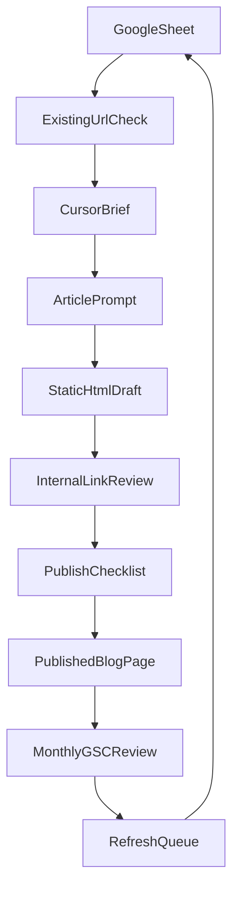

# Agadir SEO Content Workflow

Use this as the lightweight operating system for planning, writing, publishing, linking, and refreshing travel-guide content on `agadirlocalguide.com`.

The goal is not just to publish more blog posts. The goal is to grow topic authority, support bookings, and keep the workflow simple enough to run every week inside Cursor with static HTML files.

## Core Rule
Refresh an existing URL before creating a new one when the site already has a close-match page.

## Before Creating a New Article
Run this checklist first:
- Does a similar URL already exist in `blog/`, `travel-guide.html`, or `tours/`?
- Can the existing page be refreshed, expanded, or repositioned instead of publishing a net-new page?
- Would a new page create keyword cannibalization with an existing guide, itinerary, comparison, or tour page?
- Does the idea strengthen an existing topic cluster instead of creating an isolated article?
- Does the article support a booking page, priority hub, or another money page?

Default decision order:
1. refresh an existing page
2. consolidate overlapping pages
3. reposition a page for better intent match
4. create a new article only when there is no strong existing fit

## Workflow Map


## What Lives Where
- Planning database: `seo-cockpit/google-sheets-content-database.tsv`
- Article prompt: `seo-cockpit/prompts/article-generation.md`
- Editing prompt: `seo-cockpit/prompts/article-editing.md`
- Internal linking rules: `seo-cockpit/internal-linking-playbook.md`
- HTML article template: `seo-cockpit/blog-article-template.html`
- Final QA + monthly review: `seo-cockpit/publishing-checklist-and-monthly-update-sop.md`

## Site Conventions
- Published articles live in `blog/`
- Main blog hub is `travel-guide.html`
- Tour pages live in `tours/`
- Blog pages should follow the existing shell used by `blog/agadir-day-trips.html`
- Blog styling and behavior come from `blog.css` and `blog.js`
- Blog breadcrumbs should point to `../index.html` -> `../travel-guide.html` -> current article

## Topic Clusters
Use these as the starter topic map. Each new article should strengthen one cluster, not float on its own.

### Paradise Valley
- Main pillar article: `blog/paradise-valley-agadir-guide.html`
- Supporting blog ideas: Paradise Valley swimming conditions, Paradise Valley half-day vs full-day, what to pack for Paradise Valley, Paradise Valley with kids, Paradise Valley transport guide
- Target tour or money page: `tours/tour-paradise-valley-agadir-new.html`
- Internal linking direction: supporting articles -> pillar guide -> Paradise Valley tour page

### Agadir Things To Do
- Main pillar article: `blog/top-10-things-to-do-agadir-2026.html`
- Supporting blog ideas: free things to do in Agadir, things to do in Agadir at night, things to do in Agadir for couples, things to do in Agadir when it rains, first-time visitor activity guide
- Target tour or money page: `all-tours.html` and `tours/tour-agadir-guided-city-tour-cable-car.html`
- Internal linking direction: supporting articles -> things-to-do pillar -> best-fit city or activity tour pages

### Agadir Itineraries
- Main pillar article: `blog/agadir-3-day-itinerary.html`
- Supporting blog ideas: 1-day Agadir itinerary, 5-day Agadir itinerary, Agadir weekend itinerary, Agadir itinerary without a car, itinerary for first-time visitors
- Target tour or money page: `all-tours.html` plus the most relevant day trip or city tour page
- Internal linking direction: itinerary articles -> itinerary pillar -> relevant activity or day-trip pages

### Agadir Day Trips
- Main pillar article: `blog/agadir-day-trips.html`
- Supporting blog ideas: best day trips from Agadir without a car, Marrakech vs Essaouira day trip, Taroudant day trip guide, day trips for cruise visitors, best half-day trips from Agadir
- Target tour or money page: `tours/day-trip-marrakech-from-agadir-new.html`, `tours/day-trip-essaouira-from-agadir-new.html`, `tours/day-trip-taroudant-from-agadir-new.html`
- Internal linking direction: supporting articles -> day trips pillar -> specific day-trip tour pages

### Agadir Beaches
- Main pillar article: create `blog/best-beaches-agadir.html` when demand justifies it; until then support `blog/top-10-things-to-do-agadir-2026.html`
- Supporting blog ideas: Agadir beach guide, Taghazout vs Agadir beach, best beaches near Agadir for families, beach clubs and promenades, windy beach days in Agadir
- Target tour or money page: `tours/tour-jet-ski-agadir-new.html`, `tours/tour-agadir-half-day-boat-trip.html`, `tours/tour-surf-lessons-agadir.html`
- Internal linking direction: beach support articles -> beach pillar or things-to-do pillar -> beach and water-activity tour pages

### Agadir Accommodation And Hotels
- Main pillar article: create `blog/where-to-stay-in-agadir.html`
- Supporting blog ideas: best hotels in Agadir, all-inclusive hotels in Agadir, Agadir beach hotels, cheap hotels in Agadir, 5-star hotels in Agadir, Agadir vs Taghazout where to stay
- Target tour or money page: `all-tours.html`, `tours/tour-agadir-guided-city-tour-cable-car.html`
- Internal linking direction: accommodation support articles -> where-to-stay pillar -> itinerary and things-to-do hubs -> relevant city and easy-planning tour pages

### Agadir Family Activities
- Main pillar article: `blog/things-to-do-agadir-families.html`
- Supporting blog ideas: Agadir with toddlers, rainy-day family activities, best easy excursions for families, family beach day planning, safest family-friendly activities in Agadir
- Target tour or money page: `tours/tour-agadir-guided-city-tour-cable-car.html`, `tours/tour-paradise-valley-agadir-new.html`
- Internal linking direction: family support articles -> family pillar -> easy, low-friction family-suitable tour pages

### Agadir Adventure Activities
- Main pillar article: `blog/quad-biking-agadir-guide.html`
- Supporting blog ideas: buggy vs quad biking in Agadir, jet ski vs boat trip, beginner adventure activities, best outdoor activities near Agadir, combo adventure day ideas
- Target tour or money page: `tours/tour-agadir-half-quad-biking-adventure.html`, `tours/tour-buggy-adventure-agadir.html`, `tours/tour-jet-ski-agadir-new.html`, `tours/tour-sandboarding-agadir.html`
- Internal linking direction: support articles -> adventure pillar -> best-fit activity page

### Agadir Food And Local Culture
- Main pillar article: create `blog/agadir-food-guide.html` when demand justifies it; until then support `blog/top-10-things-to-do-agadir-2026.html`
- Supporting blog ideas: what to eat in Agadir, Agadir souk tips, traditional Moroccan breakfast in Agadir, local etiquette for visitors, cooking class vs food tour style article
- Target tour or money page: `tours/tour-cooking-class-agadir.html`, `tours/tour-agadir-guided-city-tour-cable-car.html`
- Internal linking direction: cultural support articles -> food or culture pillar -> cooking class or city tour page

## Simple Weekly Publishing Flow
1. Add or update one row in the Google Sheet.
2. Decide `refresh`, `consolidate`, `reposition`, or `new`.
3. Fill the brief fields in the row before writing.
4. Check which cluster and money page the article should support.
5. Use the article generation prompt in Cursor.
6. Drop the draft into `seo-cockpit/blog-article-template.html` or an existing article shell.
7. Add internal links and place relevant CTAs in the intro, before the midpoint, and before the FAQ.
8. Run the publishing checklist.
9. Publish the final file under `blog/your-slug.html`.
10. Update `travel-guide.html` and `sitemap.xml` if needed.
11. Submit the updated URL to IndexNow and resubmit the sitemap when a batch is done.

## Step By Step
### 1. Plan in Google Sheets
Use one row per article or refresh task.

Minimum fields to fill before writing:
- primary keyword
- search intent label
- article category
- topic cluster
- target tour page
- existing URL to refresh or new slug
- CTA goal
- status

If the article supports bookings, the target tour page is required.

#### Search intent labels
Do not use vague intent labels. Pick one of these:
- `informational`: answer a clear question, explain a place, or solve a travel-planning problem
- `commercial investigation`: help the reader compare options before booking
- `transactional`: support a booking-ready searcher looking for price, timing, inclusions, or the best operator
- `local navigation`: help the reader understand where to go, how to get there, or what is nearby
- `comparison`: compare destinations, tours, routes, or activity types
- `itinerary planning`: help the reader build a schedule across one or more days
- `seasonal/travel timing`: help the reader decide when to visit based on weather, crowds, or seasonal conditions

Use intent to shape the page:
- article angle: informational pages teach first; commercial and transactional pages shorten the distance to a booking page; comparison pages help choose; itinerary pages organize time and sequencing
- CTA placement: low-intent pages use softer intro CTAs and stronger later CTAs; commercial pages can surface a stronger CTA earlier; itinerary and family pages should use helpful planning CTAs before direct booking asks
- internal links: informational pages point to pillar and money pages; comparison pages point to both compared topics plus the recommended next step; itinerary pages link to the exact tours or places by sequence

### 2. Build the draft in Cursor
Use `seo-cockpit/prompts/article-generation.md`.

Always give Cursor:
- primary keyword
- secondary keywords
- search intent label
- topic cluster
- article category
- target tour page
- related blog URLs
- CTA goal
- publish month
- featured image direction

#### SERP CTR rules
Treat the title and meta description as part of the article brief, not as an afterthought.

SEO title rules:
- put `Agadir` near the front when it improves relevance
- lead with the main query, then sharpen with a real promise
- use the year only when freshness matters, such as prices, best-of lists, or current travel timing
- avoid generic AI-style titles like "Ultimate Guide", "Everything You Need to Know", or "Discover the Best"
- prefer concrete wording: price, travel time, comparison, family fit, day-trip fit, or local advice

Meta description rules:
- summarize the exact problem the article solves
- include one useful qualifier such as timing, prices, families, transport, or booking fit
- mention the next step naturally when relevant
- keep it human and specific, not bloated with synonyms

Weak vs strong title examples:
- weak: `Paradise Valley Guide`
- strong: `Paradise Valley Agadir Guide: When To Go, What To Pack, And If It Is Worth It`
- weak: `Best Things to Do in Agadir - Complete Guide`
- strong: `Agadir Things To Do: The Best Activities, Day Trips, And Easy First Picks`
- weak: `Agadir vs Marrakech`
- strong: `Agadir Vs Marrakech: Which Is Better For Beaches, Day Trips, And First-Time Visitors?`

#### Humanization rules
Every article should include:
- one local insider tip
- one common tourist mistake to avoid
- one realistic timing or transport note
- one `best for` recommendation
- simple, natural English
- no bland generic travel-guide tone

Write like a helpful local guide or practical travel planner, not like a generic AI summary.

### 3. Match the live HTML pattern
Base new pages on:
- `blog/agadir-day-trips.html`
- `blog/agadir-3-day-itinerary.html`
- `blog/top-10-things-to-do-agadir-2026.html`

Required page blocks:
- hero
- table of contents
- article body
- relevant CTA blocks based on intent and booking fit
- FAQ accordion
- related articles
- related tours or popular tours sidebar
- BlogPosting schema
- FAQPage schema

#### CTA rules
Use relevant tour CTAs only. Do not force a random tour into a loosely related article.

- informational articles: soft CTA after the intro, stronger CTA before the midpoint, final CTA before the FAQ; link to the most relevant next-step tour or pillar page
- commercial-intent articles: introduce the best-fit booking option early, reinforce with comparison logic before the midpoint, and close with a direct CTA before the FAQ
- itinerary articles: use planning-first CTAs after the intro, then place activity CTAs at the exact point in the itinerary where the reader would book them
- comparison articles: keep the CTA neutral until a recommendation is clear, then place the strongest CTA after the decision section and before the FAQ
- family or travel-planning articles: keep the first CTA soft and reassurance-based, then use a stronger CTA once suitability, logistics, and comfort are clear

Default CTA placement:
1. soft CTA after intro
2. stronger CTA before midpoint
3. final CTA before FAQ

#### Image SEO rules
Every blog post should include:
- compressed `WebP` images
- descriptive file names such as `paradise-valley-agadir-rock-pools.webp`
- helpful alt text that explains the real scene
- one strong featured image
- local or destination-specific image context in captions or nearby copy when useful
- no generic stock-photo feel when better local imagery is available

## Featured Image Generation Workflow
Use this workflow to create cinematic, SEO-friendly featured images for important blog posts with the latest GPT image generation model.

Goal:
- every important blog article should have a custom featured image
- images should feel like a premium travel magazine or editorial cover
- prioritize realistic photography over a generic AI-art look
- match the Ranch Tamri and Agadir Local Guide brand identity
- avoid fake-looking faces, oversaturated skies, and unrealistic scenery
- use warm natural lighting and Morocco-specific atmosphere

Image style direction:
- cinematic travel photography
- luxury tourism editorial
- authentic Moroccan atmosphere
- warm golden-hour lighting
- realistic textures
- clean composition
- premium but natural

Featured image requirements:
- landscape format
- optimized for social sharing and blog hero usage
- strong visual focal point
- minimal or no text overlay unless specifically needed
- destination-specific visuals only
- no generic stock-photo feeling

Generation workflow:
1. generate the image prompt from the article title and primary keyword
2. include the destination, activity, mood, time of day, traveler type, and cinematic direction
3. generate the image with the newest GPT image model
4. export an optimized `WebP` version
5. save the file with a descriptive filename

Default prompt ingredients:
- destination: the exact place in Agadir, Taghazout, Paradise Valley, Souss Massa, or the linked destination
- activity: what the traveler is actually doing
- mood: relaxed, adventurous, family-friendly, premium, or practical depending on the article
- time of day: usually golden hour, early morning, or late afternoon when it improves realism
- traveler type: couple, family, solo traveler, friends, or no visible people if the location should lead
- cinematic direction: premium editorial, realistic travel photography, natural color grading, clean composition

Prompt rules:
- keep the scene destination-specific and believable
- ask for realistic lighting, textures, and landscape depth
- mention Morocco-specific atmosphere where relevant
- avoid visual clichés, heavy filters, fantasy scenery, and plastic-looking skin
- prefer minimal or no text overlay

Filename examples:
- `agadir-cable-car-sunset.webp`
- `paradise-valley-natural-pools.webp`
- `agadir-family-travel-guide.webp`

Alt text rules:
- describe the actual scene naturally
- include destination context
- avoid keyword stuffing

Example alt text:
`Travelers enjoying the Agadir cable car at sunset overlooking the marina and coastline.`

For every article brief, Cursor should also generate:
- image prompt
- alt text
- filename suggestion
- social share image suggestion

#### Schema rules
Keep `BlogPosting` and `FAQPage` as defaults.

Also use:
- `BreadcrumbList` on blog pages that follow the standard breadcrumb path
- `ItemList` for list-style pages such as best things to do, best day trips, or ranked comparisons
- `TouristDestination` when the page is primarily about a destination or place, not just a general travel article
- `Product` or tour-focused schema when the page strongly supports a specific bookable tour and includes enough commercial detail to justify it

### 4. Internal linking rules
Every article must include:
- `2-4` links to other blog pages
- `1-2` links to relevant tour pages
- one contextual link to a priority hub or money page

Use the category rules in `seo-cockpit/internal-linking-playbook.md`.

Internal linking direction should usually follow this pattern:
1. support article -> pillar page
2. pillar page -> related support content
3. informational page -> relevant money page
4. comparison or itinerary page -> exact tour or destination page that matches the decision

### 5. Publish with light ops
After publishing:
1. confirm the final path and canonical URL match
2. update `travel-guide.html` if the new post should appear on the hub
3. update `sitemap.xml`
4. submit the changed URL:

```bash
npm run indexnow:submit -- /blog/your-slug.html
```

5. resubmit the sitemap after a publish batch:

```bash
npm run gsc:submit-sitemap
```

## Status Definitions
- `idea`: not briefed yet
- `briefed`: row is ready for drafting
- `drafted`: first article draft exists
- `editing`: refining links, metadata, and layout
- `ready`: passed the checklist
- `published`: live on the site
- `refresh-needed`: keep the URL but improve title, intro, links, FAQ, or CTA

## Monthly Refresh Loop
Use the GSC connector to pull the optimization queue:

```bash
npm run gsc:cli:md -- --days 28
```

Prioritize:
1. pages with high impressions and weak CTR
2. pages in positions `3-15`
3. pages that can better support tour bookings

When a page needs work, change its sheet status to `refresh-needed` and assign one next action:
- `rewrite title/meta` when the page gets impressions but weak CTR
- `tighten intro` when the page ranks but the opening is too generic or weak for engagement
- `expand FAQ/section coverage` when impressions suggest the topic is broader than the current page
- `add links/CTA` when the page ranks in positions `3-15` and needs stronger internal authority or clearer booking support
- `improve conversion path` when the page gets traffic but does not help generate bookings

Monthly refresh logic:
- low CTR -> rewrite title and meta description first
- weak engagement -> rewrite the intro and opening section framing
- strong impressions with mixed long-tail queries -> expand FAQ and section coverage
- positions `3-15` -> add stronger internal links from related cluster pages and hubs
- traffic without bookings -> improve CTA relevance, placement, and offer match

## Default Content Priorities
These pages should usually receive support links before lower-priority pages:
- `blog/agadir-day-trips.html`
- `blog/paradise-valley-agadir-guide.html`
- `blog/agadir-3-day-itinerary.html`
- `blog/top-10-things-to-do-agadir-2026.html`
- `tours/day-trip-marrakech-from-agadir-new.html`
- `tours/tour-paradise-valley-agadir-new.html`
- `tours/tour-agadir-guided-city-tour-cable-car.html`
- `all-tours.html`

## Keep It Simple
- do not add a CMS
- do not add a database
- do not add build tooling for blog generation
- keep everything copy-paste friendly
- use the current HTML, CSS, and JS patterns already on the site
