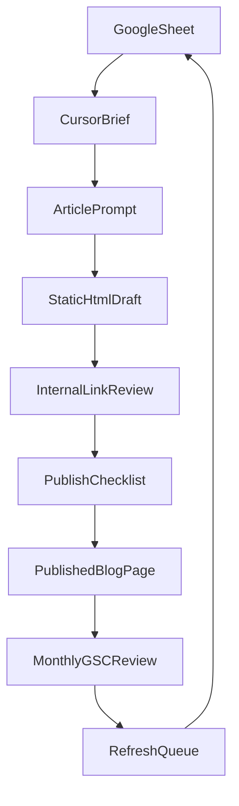

# Agadir SEO Content Workflow

Use this as the simple operating system for planning, writing, publishing, linking, and refreshing travel-guide content on `agadirlocalguide.com`.

## Core Rule
Refresh an existing URL before creating a new one when the site already has a close-match page.

## Workflow Map


## What Lives Where
- Planning database: `seo-cockpit/google-sheets-content-database.tsv`
- Article prompt: `seo-cockpit/prompts/article-generation.md`
- Editing prompt: `seo-cockpit/prompts/article-editing.md`
- Internal linking rules: `seo-cockpit/internal-linking-playbook.md`
- HTML article template: `seo-cockpit/blog-article-template.html`
- Final QA + monthly review: `seo-cockpit/publishing-checklist-and-monthly-update-sop.md`

## Site Conventions
- Published articles live in `blog/`
- Main blog hub is `travel-guide.html`
- Tour pages live in `tours/`
- Blog pages should follow the existing shell used by `blog/agadir-day-trips.html`
- Blog styling and behavior come from `blog.css` and `blog.js`
- Blog breadcrumbs should point to `../index.html` -> `../travel-guide.html` -> current article

## Simple Weekly Publishing Flow
1. Add or update one row in the Google Sheet.
2. Decide `refresh` or `new`.
3. Fill the brief fields in the row before writing.
4. Use the article generation prompt in Cursor.
5. Drop the draft into `seo-cockpit/blog-article-template.html` or an existing article shell.
6. Add internal links and one tour CTA before the article midpoint.
7. Run the publishing checklist.
8. Publish the final file under `blog/your-slug.html`.
9. Update `travel-guide.html` and `sitemap.xml` if needed.
10. Submit the updated URL to IndexNow and resubmit the sitemap when a batch is done.

## Step By Step
### 1. Plan in Google Sheets
Use one row per article or refresh task.

Minimum fields to fill before writing:
- primary keyword
- search intent
- article category
- target tour page
- slug
- status

If the article supports bookings, the target tour page is required.

### 2. Build the draft in Cursor
Use `seo-cockpit/prompts/article-generation.md`.

Always give Cursor:
- primary keyword
- secondary keywords
- article category
- target tour page
- related blog URLs
- CTA goal
- publish month

### 3. Match the live HTML pattern
Base new pages on:
- `blog/agadir-day-trips.html`
- `blog/agadir-3-day-itinerary.html`
- `blog/top-10-things-to-do-agadir-2026.html`

Required page blocks:
- hero
- table of contents
- article body
- one recommended tour CTA
- FAQ accordion
- related articles
- related tours or popular tours sidebar
- BlogPosting schema
- FAQPage schema

### 4. Internal linking rules
Every article must include:
- `2-4` links to other blog pages
- `1-2` links to relevant tour pages
- one contextual link to a priority hub or money page

Use the category rules in `seo-cockpit/internal-linking-playbook.md`.

### 5. Publish with light ops
After publishing:
1. confirm the final path and canonical URL match
2. update `travel-guide.html` if the new post should appear on the hub
3. update `sitemap.xml`
4. submit the changed URL:

```bash
npm run indexnow:submit -- /blog/your-slug.html
```

5. resubmit the sitemap after a publish batch:

```bash
npm run gsc:submit-sitemap
```

## Status Definitions
- `idea`: not briefed yet
- `briefed`: row is ready for drafting
- `drafted`: first article draft exists
- `editing`: refining links, metadata, and layout
- `ready`: passed the checklist
- `published`: live on the site
- `refresh-needed`: keep the URL but improve title, intro, links, FAQ, or CTA

## Monthly Refresh Loop
Use the GSC connector to pull the optimization queue:

```bash
npm run gsc:cli:md -- --days 28
```

Prioritize:
1. pages with high impressions and weak CTR
2. pages in positions `3-15`
3. pages that can better support tour bookings

When a page needs work, change its sheet status to `refresh-needed` and assign one next action:
- `rewrite title/meta`
- `tighten intro`
- `add links/CTA`
- `expand FAQ/section coverage`

## Default Content Priorities
These pages should usually receive support links before lower-priority pages:
- `blog/agadir-day-trips.html`
- `blog/paradise-valley-agadir-guide.html`
- `blog/agadir-3-day-itinerary.html`
- `blog/top-10-things-to-do-agadir-2026.html`
- `tours/day-trip-marrakech-from-agadir-new.html`
- `tours/tour-paradise-valley-agadir-new.html`
- `tours/tour-agadir-guided-city-tour-cable-car.html`
- `all-tours.html`

## Keep It Simple
- do not add a CMS
- do not add a database
- do not add build tooling for blog generation
- keep everything copy-paste friendly
- use the current HTML, CSS, and JS patterns already on the site
